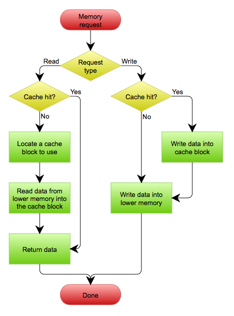

## 缓存更新套路

- **问题的根本: 缓存的操作和数据库的操作两者不能保证原子性.**

参考自: [缓存更新的套路](https://coolshell.cn/articles/17416.html)和[Cache Aside Pattern](https://mp.weixin.qq.com/s/7IgtwzGC0i7Qh9iTk99Bww)

### Cache Aside Pattern
#### 步骤如下:
- 读操作:
    1. 先读缓存
    2. 如果cache hit, 直接返回缓存; 如果cache miss, 去读DB数据, 然后set缓存.
- 写操作:
    1. 在DB写入更改的数据
    2. 写入成功后淘汰(delete)缓存

#### 特点: 
    1. 淘汰(delete)缓存, 而不是更新(set)缓存.
    2. 先操作数据库, 然后操作缓存

#### 为什么是淘汰(delete)缓存, 而不是更新(set)缓存
答: 并发写操作时, 可能会数据不一致.
如果是更新(set)缓存, 当有两个并发的写操作```write1```和```write2```, 无论是先操作DB还是先操作缓存, 总有可能出现以下问题:
    1. ```write1```先更新DB, ```write2```后更新DB.
    2. ```write2```先更新缓存, ```write1```后更新缓存.

#### 为什么先更新DB, 然后删除缓存(而不是反过来)
答: 为了避免读写并发时, 可能出现的数据不一致.
如果先删除缓存, 当并发一个读操作```read```和一个写操作```write```时:
1. ```write```操作使当前缓存失效.
2. ```read```操作读缓存, cache miss, 直接读DB, 然后set缓存(注意: 这一步不是原子操作, 但不影响推导结果)
3. ```write```操作更新数据库. 这时候缓存与DB不一致.

#### cache aside的缺点
答: 并发读写操作时, 可能数据不一致.
当并发一个读操作```read```和一个写操作```write```时:(注意: 以下均为原子操作)
1. ```read```读缓存, cache miss
2. ```read```读DB
3. ```write```更新DB
4. ```write```淘汰缓存
5. ```read```set 缓存. 这时候缓存与数据库不一致

但是这种情况出现的条件是:
1. ```read```操作时并发一个```write```操作
2. ```read```操作读缓存时cache miss
3. ```read```比```write```写DB先开始动作, 且```read```晚于```write```更新缓存. 而一般情况下, ```write```操作比```read```操作要慢得多.

### Read/Write Through Pattern
Write is done synchronously both to the cache and to the backing store.
#### write through


### Write Behind Caching Pattern
Writing is done only to the cache. A modified cache block is written back to the store, just before it is replaced.