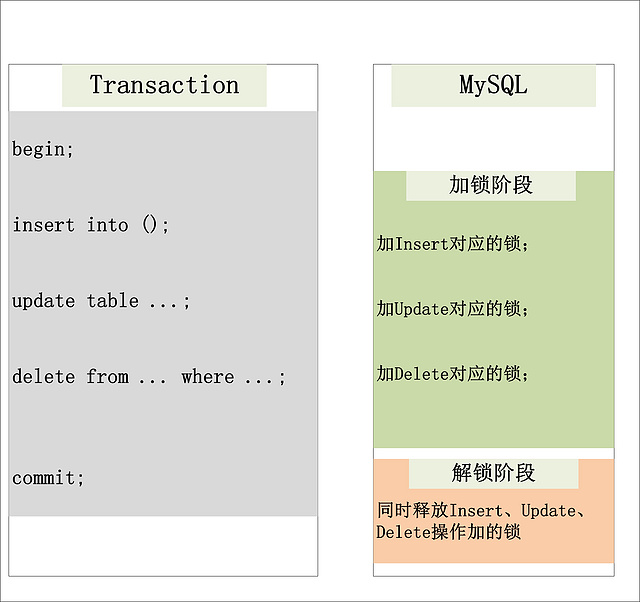

# InnoDB锁

[翻译这里](https://dev.mysql.com/doc/refman/8.0/en/innodb-locking.html)
[别人的翻译](https://segmentfault.com/a/1190000014071758)
[很好的解释](http://hedengcheng.com/?p=771)

### 背景

- MVCC: Snapshot Read(快照读) VS Current Read(当前读)
    - 快照度. 读取记录的可见版本, 可能是历史版本
    - 当前读. 读取记录的最新版本, 必然会加锁

InooDb中, 基于MVCC实现并发控制

MVCC中, 读操作有两种方式:
- 快照度(Snapshop Read): 简单的select操作, 不加锁(也有例外)
    - ```select * from table where ?;```
- 当前读(Current Read): 特殊的读操作; 插入/更新/删除操作, 都属于当前读, 加锁
    - ```select * from table where ? lock in share mode;```, S锁
    - ```select * from table where ? for update;```, X锁
    - ```insert into table values(...);```, X锁
    - ```update table set ? where ?;```, X锁
    - ```delete from table where ?;```, X锁

- 为什么插入/删除/更新属于当前读?

>从图中，可以看到，一个Update操作的具体流程。当Update SQL被发给MySQL后，MySQL Server会根据where条件，读取第一条满足条件的记录，然后InnoDB引擎会将第一条记录返回，并加锁 (current read)。待MySQL Server收到这条加锁的记录之后，会再发起一个Update请求，更新这条记录。一条记录操作完成，再读取下一条记录，直至没有满足条件的记录为止。因此，Update操作内部，就包含了一个当前读。同理，Delete操作也一样。Insert操作会稍微有些不同，简单来说，就是Insert操作可能会触发Unique Key的冲突检查，也会进行一个当前读。

- Innodb索引
[好文](http://www.cnblogs.com/hellojesson/p/6001685.html)
MySQL的索引实现分MyISAM和Innodb两种.
两种都是通过B+数实现
    - MyISAM B+树的叶子节点的data域存放数据地址
    - Innodb
        - 对于主键索引来说, B+树的叶子节点的data域存数据本身. 即数据文件就是索引文件. 所以主键索引也叫聚集索引/聚簇索引
        

        - 对于辅助索引(secondary index), B+树的叶子节点的data域存主键, 查到主键再根据主键查到数据. 所以要查找两次.
        
        

- 2PL：Two-Phase Locking(二阶段锁)
        
    - 表现形式: 加锁阶段, 只加锁, 不放锁; 解锁阶段, 只放锁, 不加锁. 即在事务中, 直到commit之前, 不会释放已加上的锁.

- 隔离级别
之前的的记录已经很详细了

- 幻读
指两次**当前读**, 结果不一样.(注意, **当前读**包括插入/删除/更新等操作)

- 在SQL标准中, RR(repeatable read)级别不能防止幻读现象. 当MySQL通过RR+NK(next-key lock)锁, 可以防止幻读现象.


### Share and Exclusive Locks(共享锁, 排他锁)

- 共享锁允许持锁事务读取一行
- 排它锁允许持锁事务更新或者删除一行

如果事务 T1 持有行 r 的 s 锁，那么另一个事务 T2 请求 r 的锁时，会做如下处理：

- T2 请求 s 锁立即被允许，结果 T1 T2 都持有 r 行的 s 锁
- T2 请求 x 锁不能被立即允许

如果 T1 持有 r 的 x 锁，那么 T2 请求 r 的 x、s 锁都不能被立即允许，T2 必须等待T1释放 x 锁才行。

### Intention Locks(意向锁)

### Record Locks(记录锁)

### Gap Locks(间隙锁)

### Next-Key Locks

### AUTO-INC Locks(自增锁)

### Predicate Locks for Spatial Indexes(空间索引断言锁)

### MVCC(multi-version concurrency control) VS LBCC(lock-based concurrency control)

### 执行计划(execution plan)
[文档](https://dev.mysql.com/doc/refman/5.5/en/execution-plan-information.html)


### 注意
1. 排他锁 vs 间隙锁 
T1: ```select * from table where id=1 for update``` 
T2: ```select * from table where id=1 for update```
当T1和T2并发, 如果```id=1```存在, 则后执行的事务被阻塞(加了排他锁); 如果```id=1```不存在, 则不会阻塞(加了间隙排他锁)
> 同样值得注意的是，不同的事务可能会在一个间隙中持有冲突的锁，例如，事务A可以持有一个间隙上共享的间隙锁（gap s lock）同时事务B持有
该间隙的排他的间隙锁（gap x lock），冲突的间隙锁被允许的原因是如果一条记录从索引中被清除了，那么这条记录上的间隙锁必须被合并。

2. 验证nk锁
表wayne, 有三个字段. id, uid ,xid. id是主键, uid是唯一索引, xid是普通索引(可以重复)

有数据:

|id|uid|xid|
|---|---|---|---|
|1|1|1|
|3|3|3|
|5|5|5|
|7|7|7|
|20|20|20|

实验1:
T1: ```select * from wayne where id=3 for update;```
T2: ```select * from wayne where id=3 for update;```

结果: T2被阻塞. 因为T1在id=3处加了X锁

实验2:
T1: ```select * from wayne where id=3 for update;```
T2: ```insert into wayne (id, uid, xid) values (2, 2, 2);```

结果: T1, T2都正常执行. 所以主键不会使用nk锁

实验3:
T1: ```select * from wayne where xid=3 for update```
T2: ```insert into wayne where xid=2```

结果:
T2阻塞. ```xid=3```附近的间隙被锁定. 使用普通索引的加锁操作会加nk锁.

结论:
1. 加nk锁只会在使用普通索引时出现, 因为主键和唯一索引都具有唯一性.(查询不存在的记录也会出现, 未证实)
2. 锁住的区间是前开后闭, 且区间的上下限以数据库的记录为依据, 而不是以SQL语句的条件为依据. 此例中可能被锁住的间隙是```xid```: (-negative infinite, 1], (1, 3], (3, 5], (5, 7], (7, 20], (20, +negative infinite) 


