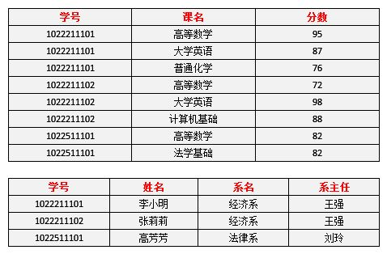
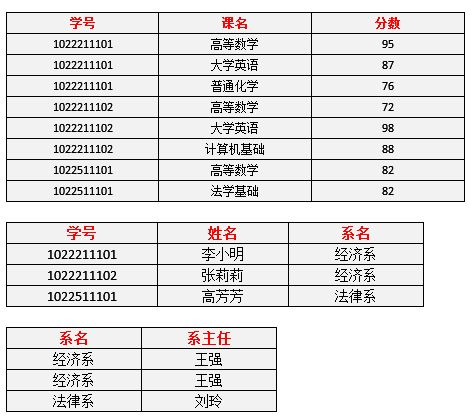

# 数据库范式, normal form

## 前置知识
- 第一范式例子

- 第二范式例子

- 第三范式例子

- 码
    - 设K为某表的一个属性或属性组, 如果除K以外的属性都**完全依赖**于K, 则称K为候选码, 简称码
- 主属性
    - 构成码的属性
- 完整性约束
    - 实体完整性
        - 数据库中每一行对应现实世界的一个实体, 因此需要有一个属性或属性组来唯一表示
        - 属性或属性组必须唯一, 且不能为空
    - 参照完整性
        - 两个有关系的表, 他们的外键和主键必须对应起来
        - 当一个主键被删除后, 外键要设为空或删除该实体记录
    - 用户定义的完整性
- 函数依赖
    - 完全函数依赖
        - 若存在属性组X, Y, 如果当X确定后, Y必然确定; 且X的真子集确定后, Y不能确定(这是与部分依赖的区别), 则Y完全依赖于X.
    - 部分函数依赖
        - 若存在属性组X, Y, 如果X的真子集确定后, Y的结果也确定, 则Y部分依赖于X
    - 传递函数依赖
        - 如果Z函数依赖于Y, Y函数依赖于X, 则称Z传递依赖于X

##  数据库范式
- 第一范式
    - 列的原子性
    - 所有的关系式数据库(RDBMS)都必然符合第一范式
    - 缺点:
        - 数据冗余, 明显
        - 插入异常, 在学生数据不确定的情况下, 无法将系名与系主任的数据单独添加到表中.(根据实体完整性)
        - 删除异常, 如果删除这个系的所有学生, 那么系与系主任的信息也被删除了
        - 修改异常, 如果某个学生要转系, 那么需要修改多跳记录
- 第二范式
    - 定义: 在1NF的基础上, 非主属性对码不存在部分函数关系. 即非主属性必须对码是完全依赖的.
    - 在图第一范式例子中, 码是学号+课名, 则学生名字对学号是完全依赖, 系对学号是完全函数依赖, 系主任对学号是完全函数依赖, 所以他们对码都是部分函数依赖, 因此不符合第二范式.
    - 优点:
        - 数据冗余. 比第一范式好
        - 修改异常. 学生要转系, 只需要修改一条记录即可
    - 缺点
        - 插入异常. 还是没有办法在没有学生数据的时候插入系的数据
        - 删除异常, 删除学生信息还是会把系的信息也删除了
- 第三范式
    - 定义: 在2NF的基础上, 非主属性对码不存在传递函数依赖关系.
    - 在图第二范式例子中, 系主任完全函数依赖于系名, 系名完全函数依赖于学号, 所以系主任传递函数依赖于学号, 因此不符合第二范式
    - 优点:
        - 数据冗余. 效果最好
        - 删除异常. 删除学生信息, 系的信息还在
        - 插入异常. 可以在没有学生信息的时候就插入系信息

- BCNF范式
    - 例子:
        1. 某公司有若干个仓库
        2. 每个仓库只有一个管理员, 一个管理员只能在一个仓库工作
        3. 一个仓库可以存放多个物品, 一个物品可以存放在多个仓库中.
        4. 每个物品在仓库中有想要的数量
    - 分析:
        1. 分析得到需要处理的字段有: 仓库, 管理员, 物品, 数量
        2. 仓库 -> 管理员; 管理员 -> 仓库; (仓库, 物品) -> 数量; (管理员, 物品) -> 数量
        3. 因此码是(仓库, 物品)和(管理员, 物品)(是的, 可以有多个码). 主属性是仓库, 物品, 管理员, 非主属性是数量.
        4. 由此可得该设计符合3NF
    - 问题:
        1. 增加一个仓库, 在没有物品的时候, 不能设置管理员. 因为物品是主属性, 根据实体完整性, 主属性不能为空.
        2. 如果要更换管理员, 则要更新很多条数据库记录
        3. 如果仓库被清空后, 则把仓库与管理员的信息也删除了
    - BCNF定义:
        - 主属性与码不能存在部分函数依赖或传递函数依赖
        - 例子中, 主属性管理员, 与码(仓库名, 物品), 存在部分函数依赖的关系
    - 把数据库表拆为两个表:
        - 仓库表: (仓库, 管理员)
        - 库存表: (仓库, 物品, 数量)
- 注意:
    1. 码又叫做候选码, 又叫候选键(candidate key)
    2. 主键又叫做主码(primary key)
    3. 一个数据库表可以有多个候选码, 但只能有一个主码
    4. 超键(super key), 是候选键与非主属性的排列组合, 候选键是最小的超键.
